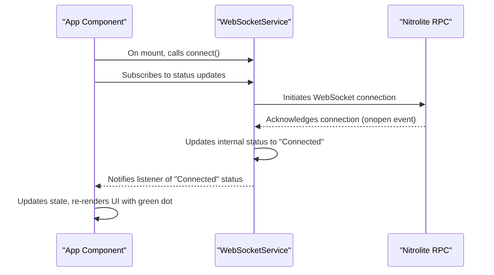

# Chapter 2: Initializing the WebSocket Connection

## Goal

To keep our code organized, we will create a dedicated service to manage the WebSocket connection. This service will handle connecting to the Nitrolite RPC and allow other parts of our application to subscribe to status updates. The `App` component will then use this service and display a real-time status indicator in the UI.

## Interaction Flow

This diagram shows how the `App` component uses the `WebSocketService`.



## Key Tasks

1.  **Create a WebSocket Service**: We will create a new file `src/lib/websocket.ts`. This class will manage the connection lifecycle. While it has advanced features for later, our focus now is just on the connection status.
2.  **Refactor `App.tsx`**: The `App` component will be simplified to import the service, call `connect()` in a `useEffect`, and subscribe to the status updates to manage its local state.
3.  **Display Connection Status**: A small indicator will be added to the UI to provide immediate visual feedback on the connection's health.

## Implementation Steps

### 1. Create the WebSocket Service

Create a new file at `src/lib/websocket.ts`. This service will handle all the logic for the WebSocket connection. We are building it with methods like `send` and message listeners that we will use in later chapters.

```typescript
// filepath: src/lib/websocket.ts
export type WsStatus = 'Connecting' | 'Connected' | 'Disconnected';

type StatusListener = (status: WsStatus) => void;
type MessageListener = (data: any) => void;

class WebSocketService {
    private socket: WebSocket | null = null;
    private status: WsStatus = 'Disconnected';
    private statusListeners: Set<StatusListener> = new Set();
    private messageListeners: Set<MessageListener> = new Set();
    private messageQueue: string[] = [];
    private requestId = 1;

    public connect() {
        if (this.socket && this.socket.readyState < 2) return;
        const wsUrl = import.meta.env.VITE_NITROLITE_WS_URL;
        if (!wsUrl) {
            console.error('VITE_NITROLITE_WS_URL is not set');
            this.updateStatus('Disconnected');
            return;
        }
        this.updateStatus('Connecting');
        this.socket = new WebSocket(wsUrl);
        this.socket.onopen = () => {
            console.log('WebSocket Connected');
            this.updateStatus('Connected');
            this.messageQueue.forEach((msg) => this.socket?.send(msg));
            this.messageQueue = [];
        };
        this.socket.onmessage = (event) => {
            try {
                const data = JSON.parse(event.data);
                this.messageListeners.forEach((listener) => listener(data));
            } catch (error) {
                console.error('Error parsing message:', error);
            }
        };
        this.socket.onclose = () => this.updateStatus('Disconnected');
        this.socket.onerror = () => this.updateStatus('Disconnected');
    }

    public send(method: string, params: any) {
        const payload = JSON.stringify({ jsonrpc: '2.0', id: this.requestId++, method, params });
        if (this.socket?.readyState === WebSocket.OPEN) this.socket.send(payload);
        else this.messageQueue.push(payload);
    }

    private updateStatus(newStatus: WsStatus) {
        this.status = newStatus;
        this.statusListeners.forEach((listener) => listener(this.status));
    }

    public addStatusListener(listener: StatusListener) {
        this.statusListeners.add(listener);
        listener(this.status);
    }

    public removeStatusListener(listener: StatusListener) {
        this.statusListeners.delete(listener);
    }

    public addMessageListener(listener: MessageListener) {
        this.messageListeners.add(listener);
    }

    public removeMessageListener(listener: MessageListener) {
        this.messageListeners.delete(listener);
    }
}

export const webSocketService = new WebSocketService();
```

### 2. Update `App.tsx` to Use the Service

Now, refactor `src/App.tsx` to use the new service for connecting and displaying the status.

```tsx
// filepath: src/App.tsx
import { useState, useEffect } from 'preact/hooks';
import { createWalletClient, custom, type Address, type WalletClient } from 'viem';
import { mainnet } from 'viem/chains';
import { PostList } from './components/PostList/PostList';
import { posts } from './data/posts';
import { webSocketService, type WsStatus } from './lib/websocket';

export function App() {
    const [account, setAccount] = useState<Address | null>(null);
    const [walletClient, setWalletClient] = useState<WalletClient | null>(null);
    const [wsStatus, setWsStatus] = useState<WsStatus>('Disconnected');

    // This effect runs once on mount to handle the WebSocket connection
    useEffect(() => {
        // Subscribe to status updates from our service
        webSocketService.addStatusListener(setWsStatus);
        // Tell the service to connect
        webSocketService.connect();

        // On cleanup, remove the listener
        return () => {
            webSocketService.removeStatusListener(setWsStatus);
        };
    }, []);

    const connectWallet = async () => {
        if (!window.ethereum) {
            alert('Please install MetaMask!');
            return;
        }
        const client = createWalletClient({
            chain: mainnet,
            transport: custom(window.ethereum),
        });
        const [address] = await client.requestAddresses();
        setWalletClient(client);
        setAccount(address);
    };

    const formatAddress = (address: Address) => `${address.slice(0, 6)}...${address.slice(-4)}`;

    return (
        <div className="app-container">
            <header className="header">
                <div className="header-content">
                    <h1 className="logo">Nexus</h1>
                    <p className="tagline">Decentralized insights for the next generation of builders</p>
                </div>
                <div className="header-controls">
                    <div className={`ws-status ${wsStatus.toLowerCase()}`}>
                        <span className="status-dot"></span> {wsStatus}
                    </div>
                    <div className="wallet-connector">
                        {account ? (
                            <div className="wallet-info">Connected: {formatAddress(account)}</div>
                        ) : (
                            <button onClick={connectWallet} className="connect-button">
                                Connect Wallet
                            </button>
                        )}
                    </div>
                </div>
            </header>

            <main className="main-content">
                <PostList posts={posts} isWalletConnected={!!account} />
            </main>
        </div>
    );
}
```

### 3. Add Styles for the Status Indicator

Add the following styles to `src/index.css` for the new UI elements.

```css
// filepath: src/index.css
/* ... existing styles ... */
.header-controls {
    position: absolute;
    top: 2rem;
    right: 2rem;
    display: flex;
    align-items: center;
    gap: 1rem;
}

.wallet-connector {
    position: static; /* Override previous absolute positioning */
}

.ws-status {
    display: flex;
    align-items: center;
    gap: 0.5rem;
    font-family: 'JetBrains Mono', monospace;
    padding: 0.75rem 1rem;
    border-radius: 6px;
    border: 1px solid var(--border);
    background-color: var(--surface);
    font-size: 0.9rem;
}

.status-dot {
    width: 10px;
    height: 10px;
    border-radius: 50%;
    background-color: #8b949e; /* Gray for connecting */
}

.ws-status.connected .status-dot {
    background-color: #238636; /* Green */
}

.ws-status.disconnected .status-dot {
    background-color: #da3633; /* Red */
}
```

## Environment Configuration

Before running the application, make sure to set the WebSocket URL in your `.env.local` file:

```bash
# Nitrolite Configuration
VITE_NITROLITE_WS_URL=wss://clearnet.yellow.com/ws
VITE_NITROLITE_API_URL=http://localhost:8080

# Application Configuration
VITE_APP_NAME=Mono
VITE_TIP_AMOUNT=1
```

## Expected Outcome

After completing this chapter, the application will have a clean, reusable service for its WebSocket connection. On load, it will automatically connect, and a status indicator in the top-right corner will show "Connecting", then change to "Connected" (with a green dot) on success, or "Disconnected" (with a red dot) on failure.
