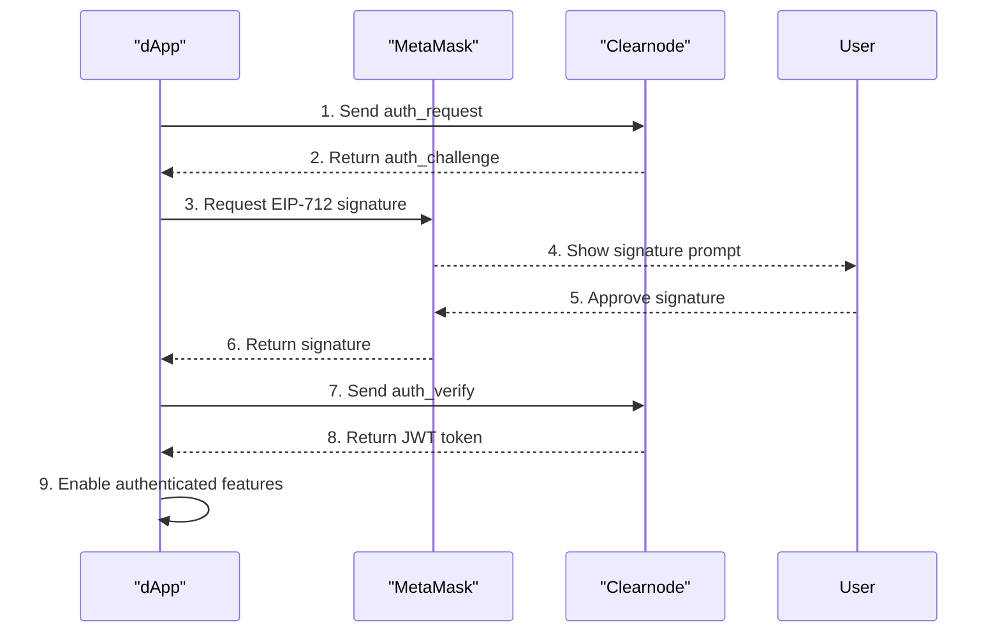

# Chapter 3: Automatic & Secure Session Authentication

## Goal

In this chapter, we will implement an **automatic** authentication flow. As soon as the user's wallet is connected and our application establishes a connection to the server, it will automatically initiate a secure authentication process. We will use a **challenge-response** mechanism with **EIP-712 structured data** for maximum security and transparency. On success, the server issues a **JSON Web Token (JWT)** for instant, secure re-authentication on future visits.

## Why This Approach?

- **Automatic Flow**: No "Authenticate" button needed - the app starts the process automatically for a seamless Web3 experience.
- **Security**: Challenge-response flow prevents replay attacks by ensuring each authentication attempt is unique.
- **Transparency**: EIP-712 shows users exactly what they're authorizing in a readable format.
- **User Experience**: JWT enables instant re-authentication on future visits without repetitive signatures.

## Interaction Flow

This diagram shows the automated, multi-step authentication process.



## Key Tasks

1. **Create Helper Utilities**: Build simple helpers for session keys and JWT storage.
2. **Update WebSocketService**: Modify the service to accept pre-formatted JSON-RPC strings.
3. **Implement Auto-Authentication**: Add automatic authentication flow to `App.tsx`.

## Implementation Steps

> **Important Note**: Replace placeholder values like "Your App Name", "your_app_name", and "your-app.com" with your actual application details throughout the code examples below.

### 1. Install Nitrolite SDK

```bash
npm install @erc7824/nitrolite
```

### 2. Create Helper Utilities

Create `src/lib/utils.ts` with session key generation and JWT helpers:

```typescript
// filepath: src/lib/utils.ts
import { generatePrivateKey, privateKeyToAccount } from 'viem/accounts';
import { type Address } from 'viem';

export interface SessionKey {
    privateKey: `0x${string}`;
    address: Address;
}

// Session key management
const SESSION_KEY_STORAGE = 'your_app_name_session_key';

export const generateSessionKey = (): SessionKey => {
    const privateKey = generatePrivateKey();
    const account = privateKeyToAccount(privateKey);
    return { privateKey, address: account.address };
};

export const getStoredSessionKey = (): SessionKey | null => {
    try {
        const stored = localStorage.getItem(SESSION_KEY_STORAGE);
        if (!stored) return null;

        const parsed = JSON.parse(stored);
        if (!parsed.privateKey || !parsed.address) return null;

        return parsed as SessionKey;
    } catch {
        return null;
    }
};

export const storeSessionKey = (sessionKey: SessionKey): void => {
    try {
        localStorage.setItem(SESSION_KEY_STORAGE, JSON.stringify(sessionKey));
    } catch {
        // Storage failed - continue without caching
    }
};

export const removeSessionKey = (): void => {
    try {
        localStorage.removeItem(SESSION_KEY_STORAGE);
    } catch {
        // Removal failed - not critical
    }
};

// JWT helpers
const JWT_KEY = 'your_app_name_jwt_token';

export const getStoredJWT = (): string | null => {
    try {
        return localStorage.getItem(JWT_KEY);
    } catch {
        return null;
    }
};

export const storeJWT = (token: string): void => {
    try {
        localStorage.setItem(JWT_KEY, token);
    } catch {}
};

export const removeJWT = (): void => {
    try {
        localStorage.removeItem(JWT_KEY);
    } catch {}
};
```

### 3. Update WebSocketService

Modify `src/lib/websocket.ts` to accept pre-formatted JSON-RPC strings:

```typescript
// In src/lib/websocket.ts, update the send method:
public send(payload: string) {
    if (this.socket?.readyState === WebSocket.OPEN) {
        this.socket.send(payload);
    } else {
        this.messageQueue.push(payload);
    }
}
```

### 4. Implement Auto-Authentication in App.tsx

Follow these steps to add automatic authentication to your app:

#### 4.1 Add Authentication Imports

Add these imports to your existing `src/App.tsx`:

```typescript
// CHAPTER 3: Authentication imports
import {
    createAuthRequestMessage,
    createAuthVerifyMessage,
    createEIP712AuthMessageSigner,
    parseAnyRPCResponse,
    RPCMethod,
    type AuthChallengeResponse,
    type AuthRequestParams,
} from '@erc7824/nitrolite';
// CHAPTER 3: Authentication utilities
import {
    generateSessionKey,
    getStoredSessionKey,
    storeSessionKey,
    removeSessionKey,
    storeJWT,
    removeJWT,
    type SessionKey,
} from './lib/utils';
```

#### 4.2 Add EIP-712 Domain Function

Add this function after your imports:

```typescript
// CHAPTER 3: EIP-712 domain for authentication
const getAuthDomain = () => ({
    name: 'Your App Name',
});

// CHAPTER 3: Authentication constants
const AUTH_SCOPE = 'your-app.com';
const APP_NAME = 'Your App Name';
const SESSION_DURATION = 3600; // 1 hour
```

#### 4.3 Add Authentication State

Add these state variables to your App component:

```typescript
// CHAPTER 3: Authentication state
const [sessionKey, setSessionKey] = useState<SessionKey | null>(null);
const [isAuthenticated, setIsAuthenticated] = useState(false);
const [isAuthAttempted, setIsAuthAttempted] = useState(false);
const [sessionExpireTimestamp, setSessionExpireTimestamp] = useState<string>('');
```

#### 4.4 Update Wallet Connection

**Important:** Replace your `connectWallet` function with this version that properly sets up the wallet client:

```typescript
const connectWallet = async () => {
    if (!window.ethereum) {
        alert('Please install MetaMask!');
        return;
    }

    // First get the address
    const tempClient = createWalletClient({
        chain: mainnet,
        transport: custom(window.ethereum),
    });
    const [address] = await tempClient.requestAddresses();

    // CHAPTER 3: Create wallet client with account for EIP-712 signing
    const walletClient = createWalletClient({
        account: address,
        chain: mainnet,
        transport: custom(window.ethereum),
    });

    setWalletClient(walletClient);
    setAccount(address);
};
```

#### 4.5 Add Session Key Generation

**IMPORTANT:** Update your initial useEffect to manage session key persistence:

```typescript
useEffect(() => {
    // CHAPTER 3: Get or generate session key on startup (IMPORTANT: Store in localStorage)
    const existingSessionKey = getStoredSessionKey();
    if (existingSessionKey) {
        setSessionKey(existingSessionKey);
    } else {
        const newSessionKey = generateSessionKey();
        storeSessionKey(newSessionKey);
        setSessionKey(newSessionKey);
    }

    webSocketService.addStatusListener(setWsStatus);
    webSocketService.connect();

    return () => {
        webSocketService.removeStatusListener(setWsStatus);
    };
}, []);
```

> **Why this is important:** Session keys must be stored in localStorage with the private key included. This prevents regenerating new keys on every page refresh, which would break authentication continuity.

#### 4.6 Add Auto-Authentication Logic

> **Critical**: The `expire` timestamp must be **exactly the same** in both `auth_request` and `auth_verify` messages. Generate it once and reuse it throughout the entire authentication flow. Mismatched timestamps (e.g., `1672531200` vs `1672531201`) will cause authentication to fail.

Add this useEffect for automatic authentication:

```typescript
// CHAPTER 3: Auto-trigger authentication when conditions are met
useEffect(() => {
    if (account && sessionKey && wsStatus === 'Connected' && !isAuthenticated && !isAuthAttempted) {
        setIsAuthAttempted(true);

        // Generate fresh timestamp for this auth attempt
        const expireTimestamp = String(Math.floor(Date.now() / 1000) + SESSION_DURATION);
        setSessionExpireTimestamp(expireTimestamp);

        const authParams: AuthRequestParams = {
            address: account,
            session_key: sessionKey.address,
            app_name: APP_NAME,
            expire: expireTimestamp,
            scope: AUTH_SCOPE,
            application: account,
            allowances: [],
        };

        createAuthRequestMessage(authParams).then((payload) => {
            webSocketService.send(payload);
        });
    }
}, [account, sessionKey, wsStatus, isAuthenticated, isAuthAttempted]);
```

#### 4.7 Add Message Handling

Add this useEffect to handle server authentication messages:

```typescript
// CHAPTER 3: Handle server messages for authentication
useEffect(() => {
    const handleMessage = async (data: any) => {
        const response = parseAnyRPCResponse(JSON.stringify(data));

        // Handle auth challenge
        if (
            response.method === RPCMethod.AuthChallenge &&
            walletClient &&
            sessionKey &&
            account &&
            sessionExpireTimestamp
        ) {
            const challengeResponse = response as AuthChallengeResponse;

            const authParams = {
                scope: AUTH_SCOPE,
                application: walletClient.account?.address as `0x${string}`,
                participant: sessionKey.address as `0x${string}`,
                expire: sessionExpireTimestamp,
                allowances: [],
            };

            const eip712Signer = createEIP712AuthMessageSigner(walletClient, authParams, getAuthDomain());

            try {
                const authVerifyPayload = await createAuthVerifyMessage(eip712Signer, challengeResponse);
                webSocketService.send(authVerifyPayload);
            } catch (error) {
                alert('Signature rejected. Please try again.');
                setIsAuthAttempted(false);
            }
        }

        // Handle auth success
        if (response.method === RPCMethod.AuthVerify && response.params?.success) {
            setIsAuthenticated(true);
            if (response.params.jwtToken) storeJWT(response.params.jwtToken);
        }

        // Handle errors
        if (response.method === RPCMethod.Error) {
            removeJWT();
            // Clear session key on auth failure to regenerate next time
            removeSessionKey();
            alert(`Authentication failed: ${response.params.error}`);
            setIsAuthAttempted(false);
        }
    };

    webSocketService.addMessageListener(handleMessage);
    return () => webSocketService.removeMessageListener(handleMessage);
}, [walletClient, sessionKey, sessionExpireTimestamp, account]);
```

#### 4.8 Update PostList Component

Update your PostList component call to pass the authentication state:

```tsx
{
    /* CHAPTER 3: Pass authentication state to PostList */
}
<PostList posts={posts} isWalletConnected={!!account} isAuthenticated={isAuthenticated} />;
```

### 5. Update PostList Component

Update `src/components/PostList/PostList.tsx` to handle authentication state:

#### 5.1 Update Interface

```typescript
interface PostListProps {
    posts: Post[];
    isWalletConnected: boolean;
    isAuthenticated: boolean; // Add this line
}
```

#### 5.2 Update Component Function

```typescript
export function PostList({ posts, isWalletConnected, isAuthenticated }: PostListProps) {
```

#### 5.3 Update Button Logic

```tsx
<button
    className={styles.supportButton}
    disabled={!isWalletConnected || !isAuthenticated}
    onClick={(e) => {
        e.preventDefault();
        handleTip(post);
    }}
>
    {!isWalletConnected ? 'Connect Wallet' : !isAuthenticated ? 'Authenticating...' : 'Support'}
</button>
```

## Expected Outcome

The application now provides a superior user experience. As soon as the user connects their wallet, the authentication process begins in the background. A single, clear EIP-712 signature request appears. Upon approval, the session is authenticated, and the "Sponsor" buttons are enabled—all without requiring any extra clicks from the user.

## Summary

You've successfully implemented automatic session authentication! The key improvements are:

- **Seamless UX**: Authentication happens automatically when wallet connects
- **Secure**: Uses EIP-712 structured data and challenge-response flow
- **Efficient**: JWT tokens enable instant re-authentication on future visits
- **Transparent**: Users see exactly what they're signing in their wallet

The sponsor buttons should now be enabled automatically after the user approves the single signature request.
