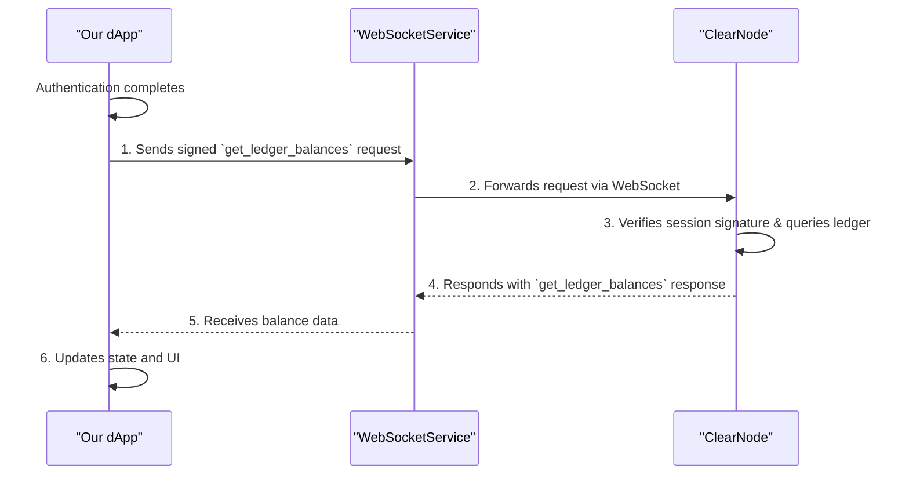

# Chapter 4: Fetching Balances with the Session Key

## Goal

Now that we have an authenticated session, we can perform actions on behalf of the user without prompting them for another signature. In this chapter, we will use the temporary **session key** to sign and send our first request: fetching the user's off-chain asset balances from the Nitrolite RPC.

## Why This Approach?

This is the payoff for the setup in Chapter 3. By using the session key's private key (which our application holds in memory), we can create a `signer` function that programmatically signs requests. This enables a seamless, Web2-like experience where data can be fetched and actions can be performed instantly after the initial authentication.

## Interaction Flow

This diagram illustrates how the authenticated session key is used to fetch data directly from ClearNode.



## Key Tasks

1. **Add Balance State**: Introduce a new state variable in `App.tsx` to store the fetched balances.
2. **Create a `BalanceDisplay` Component**: Build a simple, reusable component to show the user's USDC balance.
3. **Fetch Balances on Authentication**: Create a `useEffect` hook that automatically requests the user's balances as soon as `isAuthenticated` becomes `true`.
4. **Use a Session Key Signer**: Use the `createECDSAMessageSigner` helper from the Nitrolite SDK to sign the request using the session key's private key.
5. **Handle the Response**: Update the WebSocket message handler to parse both `get_ledger_balances` responses and automatic `BalanceUpdate` messages from the server.

## Implementation Steps

### 1. Create the `BalanceDisplay` Component

Create a new file at `src/components/BalanceDisplay/BalanceDisplay.tsx`. This component will be responsible for showing the user's balance in the header.

```tsx
// filepath: src/components/BalanceDisplay/BalanceDisplay.tsx
// CHAPTER 4: Balance display component
import styles from './BalanceDisplay.module.css';

interface BalanceDisplayProps {
    balance: string | null;
    symbol: string;
}

export function BalanceDisplay({ balance, symbol }: BalanceDisplayProps) {
    // CHAPTER 4: Format balance for display
    const formattedBalance = balance ? parseFloat(balance).toFixed(2) : '0.00';

    return (
        <div className={styles.balanceContainer}>
            <span className={styles.balanceAmount}>{formattedBalance}</span>
            <span className={styles.balanceSymbol}>{symbol}</span>
        </div>
    );
}
```

### 2. Update `App.tsx` to Fetch and Display Balances

This is the final step. We'll add the logic to fetch and display the balances.

```tsx
// filepath: src/App.tsx
import { useState, useEffect } from 'preact/hooks';
import { createWalletClient, custom, type Address, type WalletClient } from 'viem';
import { mainnet } from 'viem/chains';
import {
    createAuthRequestMessage,
    createAuthVerifyMessage,
    createEIP712AuthMessageSigner,
    NitroliteRPC,
    RPCMethod,
    type AuthChallengeResponse,
    type AuthRequestParams,
    // CHAPTER 4: Add balance fetching imports
    createECDSAMessageSigner,
    createGetLedgerBalancesMessage,
    type GetLedgerBalancesResponse,
    type BalanceUpdateResponse,
} from '@erc7824/nitrolite';

import { PostList } from './components/PostList/PostList';
// CHAPTER 4: Import the new BalanceDisplay component
import { BalanceDisplay } from './components/BalanceDisplay/BalanceDisplay';
import { posts } from './data/posts';
import { webSocketService, type WsStatus } from './lib/websocket';
import {
    generateSessionKey,
    getStoredSessionKey,
    storeSessionKey,
    removeSessionKey,
    storeJWT,
    removeJWT,
    type SessionKey,
} from './lib/utils';

const SESSION_DURATION_SECONDS = 3600; // 1 hour

export function App() {
    const [account, setAccount] = useState<Address | null>(null);
    const [walletClient, setWalletClient] = useState<WalletClient | null>(null);
    const [wsStatus, setWsStatus] = useState<WsStatus>('Disconnected');
    const [sessionKey, setSessionKey] = useState<SessionKey | null>(null);
    const [isAuthenticated, setIsAuthenticated] = useState(false);
    const [isAuthAttempted, setIsAuthAttempted] = useState(false);
    // CHAPTER 4: Add balance state to store fetched balances
    const [balances, setBalances] = useState<Record<string, string> | null>(null);
    // CHAPTER 4: Add loading state for better user experience
    const [isLoadingBalances, setIsLoadingBalances] = useState(false);

    // Initialize WebSocket connection and session key (from previous chapters)
    useEffect(() => {
        const existingSessionKey = getStoredSessionKey();
        if (existingSessionKey) {
            setSessionKey(existingSessionKey);
        } else {
            const newSessionKey = generateSessionKey();
            storeSessionKey(newSessionKey);
            setSessionKey(newSessionKey);
        }

        webSocketService.addStatusListener(setWsStatus);
        webSocketService.connect();

        return () => {
            webSocketService.removeStatusListener(setWsStatus);
        };
    }, []);

    // Auto-trigger authentication when conditions are met (from Chapter 3)
    useEffect(() => {
        if (account && sessionKey && wsStatus === 'Connected' && !isAuthenticated && !isAuthAttempted) {
            setIsAuthAttempted(true);
            const expireTimestamp = String(Math.floor(Date.now() / 1000) + SESSION_DURATION_SECONDS);

            const authParams: AuthRequestParams = {
                address: account,
                session_key: sessionKey.address,
                app_name: 'Nexus',
                expire: expireTimestamp,
                scope: 'nexus.app',
                application: account,
                allowances: [],
            };

            createAuthRequestMessage(authParams).then((payload) => {
                webSocketService.send(payload);
            });
        }
    }, [account, sessionKey, wsStatus, isAuthenticated, isAuthAttempted]);

    // CHAPTER 4: Automatically fetch balances when user is authenticated
    // This useEffect hook runs whenever authentication status, sessionKey, or account changes
    useEffect(() => {
        // Only proceed if all required conditions are met:
        // 1. User has completed authentication
        // 2. We have a session key (temporary private key for signing)
        // 3. We have the user's wallet address
        if (isAuthenticated && sessionKey && account) {
            console.log('Authenticated! Fetching ledger balances...');

            // CHAPTER 4: Show loading state while we fetch balances
            setIsLoadingBalances(true);

            // CHAPTER 4: Create a "signer" - this is what signs our requests without user popups
            // Think of this like a temporary stamp that proves we're allowed to make requests
            const sessionSigner = createECDSAMessageSigner(sessionKey.privateKey);

            // CHAPTER 4: Create a signed request to get the user's asset balances
            // This is like asking "What's in my wallet?" but with cryptographic proof
            createGetLedgerBalancesMessage(sessionSigner, account)
                .then((getBalancesPayload) => {
                    // Send the signed request through our WebSocket connection
                    console.log('Sending balance request...');
                    webSocketService.send(getBalancesPayload);
                })
                .catch((error) => {
                    console.error('Failed to create balance request:', error);
                    setIsLoadingBalances(false); // Stop loading on error
                    // In a real app, you might show a user-friendly error message here
                });
        }
    }, [isAuthenticated, sessionKey, account]);

    // This effect handles all incoming WebSocket messages.
    useEffect(() => {
        const handleMessage = async (data: any) => {
            const response = parseAnyRPCResponse(JSON.stringify(data));

            // Handle auth challenge (from Chapter 3)
            if (response.method === RPCMethod.AuthChallenge && walletClient && sessionKey && account) {
                const challengeResponse = response as AuthChallengeResponse;
                const expireTimestamp = String(Math.floor(Date.now() / 1000) + SESSION_DURATION_SECONDS);

                const authParams = {
                    scope: 'nexus.app',
                    application: walletClient.account?.address as `0x${string}`,
                    participant: sessionKey.address as `0x${string}`,
                    expire: expireTimestamp,
                    allowances: [],
                };

                const eip712Signer = createEIP712AuthMessageSigner(walletClient, authParams, {
                    name: 'Nexus',
                });

                try {
                    const authVerifyPayload = await createAuthVerifyMessage(eip712Signer, challengeResponse);
                    webSocketService.send(authVerifyPayload);
                } catch (error) {
                    alert('Signature rejected. Please try again.');
                    setIsAuthAttempted(false);
                }
            }

            // Handle auth success (from Chapter 3)
            if (response.method === RPCMethod.AuthVerify && response.params?.success) {
                setIsAuthenticated(true);
                if (response.params.jwtToken) storeJWT(response.params.jwtToken);
            }

            // CHAPTER 4: Handle balance responses (when we asked for balances)
            if (response.method === RPCMethod.GetLedgerBalances) {
                const balanceResponse = response as GetLedgerBalancesResponse;
                const balances = balanceResponse.params.ledgerBalances;

                console.log('Received balance response:', balances);

                // Check if we actually got balance data back
                if (balances && balances.length > 0) {
                    // CHAPTER 4: Transform the data for easier use in our UI
                    // Convert from: [{asset: "usdc", amount: "100"}, {asset: "eth", amount: "0.5"}]
                    // To: {"usdc": "100", "eth": "0.5"}
                    const balancesMap = Object.fromEntries(
                        balances.map((balance) => [balance.asset, balance.amount]),
                    );
                    console.log('Setting balances:', balancesMap);
                    setBalances(balancesMap);
                } else {
                    console.log('No balance data received - wallet appears empty');
                    setBalances({});
                }
                // CHAPTER 4: Stop loading once we receive any balance response
                setIsLoadingBalances(false);
            }

            // CHAPTER 4: Handle live balance updates (server pushes these automatically)
            if (response.method === RPCMethod.BalanceUpdate) {
                const balanceUpdate = response as BalanceUpdateResponse;
                const balances = balanceUpdate.params.balanceUpdates;
                
                console.log('Live balance update received:', balances);

                // Same data transformation as above
                const balancesMap = Object.fromEntries(
                    balances.map((balance) => [balance.asset, balance.amount]),
                );
                console.log('Updating balances in real-time:', balancesMap);
                setBalances(balancesMap);
            }

            // Handle errors (from Chapter 3)
            if (response.method === RPCMethod.Error) {
                removeJWT();
                removeSessionKey();
                alert(`Authentication failed: ${response.params.error}`);
                setIsAuthAttempted(false);
            }
        };

        webSocketService.addMessageListener(handleMessage);
        return () => webSocketService.removeMessageListener(handleMessage);
    }, [walletClient, sessionKey, account]);

    const connectWallet = async () => {
        if (!window.ethereum) {
            alert('Please install MetaMask!');
            return;
        }

        const tempClient = createWalletClient({
            chain: mainnet,
            transport: custom(window.ethereum),
        });
        const [address] = await tempClient.requestAddresses();

        const walletClient = createWalletClient({
            account: address,
            chain: mainnet,
            transport: custom(window.ethereum),
        });

        setWalletClient(walletClient);
        setAccount(address);
    };

    const formatAddress = (address: Address) => {
        return `${address.slice(0, 6)}...${address.slice(-4)}`;
    };

    return (
        <div className="app-container">
            <header className="header">
                <div className="header-content">
                    <h1 className="logo">Nexus</h1>
                    <p className="tagline">
                        <span>The Content Platform of Tomorrow</span>
                    </p>
                </div>
                <div className="header-controls">
                    {/* CHAPTER 4: Display balance when authenticated */}
                    {isAuthenticated && (
                        <BalanceDisplay
                            balance={
                                isLoadingBalances ? 'Loading...' : (balances?.['usdc'] ?? balances?.['USDC'] ?? null)
                            }
                            symbol="USDC"
                        />
                    )}
                    <div className={`ws-status ${wsStatus.toLowerCase()}`}>
                        <span className="status-dot"></span> {wsStatus}
                    </div>
                    <div className="wallet-connector">
                        {account ? (
                            <button
                                onClick={() => {
                                    /* Disconnect logic can be added here */
                                }}
                            >
                                {formatAddress(account)}
                            </button>
                        ) : (
                            <button onClick={connectWallet}>Connect Wallet</button>
                        )}
                    </div>
                </div>
            </header>

            <main className="main-content">
                {/* CHAPTER 4: Pass authentication state to enable balance-dependent features */}
                <PostList posts={posts} isWalletConnected={!!account} isAuthenticated={isAuthenticated} />
            </main>
        </div>
    );
}
```

## Expected Outcome

As soon as the user's session is authenticated, the application will automatically make a background request to fetch their balances. A new "Balance" component will appear in the header, displaying their current USDC balance (e.g., "100.00 USDC"). This entire process happens instantly and without any further action required from the user, demonstrating the power of session keys.

### What You'll See:

1. **Loading State**: "Loading... USDC" appears briefly while fetching balances
2. **Balance Display**: Real balance appears (e.g., "0.52 USDC")
3. **Real-time Updates**: Balance updates automatically when server pushes changes
4. **Console Logs**: Educational messages in browser console showing the process

### For Beginners: What's Happening Behind the Scenes?

- **Session Key**: Like a temporary ID card that lets your app make requests without asking you to sign every time
- **WebSocket**: Real-time connection that lets the server push updates to your app instantly
- **Balance Request**: Your app asks "What's in my wallet?" using cryptographic proof
- **Data Transformation**: Converting server response format to something easy for your UI to use

## Optional: CSS Styling for BalanceDisplay

If you want to style the `BalanceDisplay` component, create the following CSS module file:

```css
/* filepath: src/components/BalanceDisplay/BalanceDisplay.module.css */
.balanceContainer {
    display: flex;
    align-items: center;
    gap: 0.5rem;
    font-family: 'JetBrains Mono', monospace;
    padding: 0.75rem 1rem;
    border-radius: 6px;
    border: 1px solid var(--border);
    background-color: var(--surface);
    font-size: 0.9rem;
    color: var(--text-primary);
}

.balanceAmount {
    font-weight: 600;
}

.balanceSymbol {
    font-weight: 400;
    color: var(--text-secondary);
}
```
