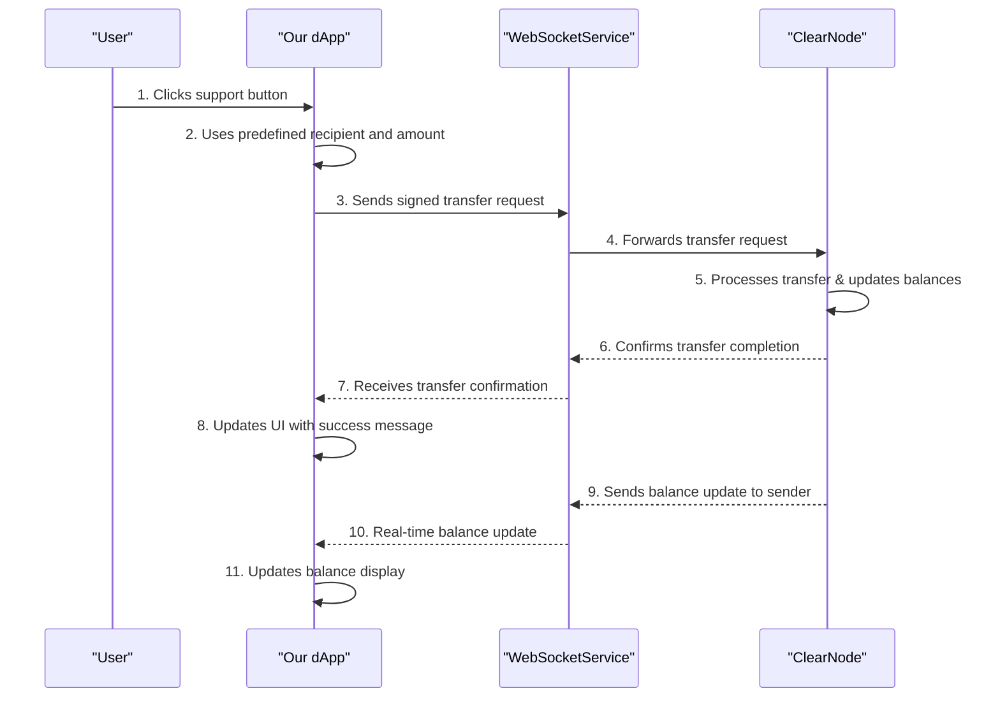

# Final Chapter: Peer-to-Peer Transfers

## Goal

In this final chapter, we'll add peer-to-peer transfer functionality to our Web3 application. Users will be able to send USDC support using session keys, creating a seamless Web2-like experience for Web3 transactions with just one button click.

## Why This Matters

This demonstrates the full power of session keys:

- **Instant Transfers**: No wallet popups after initial authentication
- **Real-time Updates**: Balance updates immediately after transfers
- **User-Friendly UX**: Simple forms instead of complex transaction flows

## Interaction Flow



## Implementation Steps

### 1. Import User Data

We'll use a predefined support address from our users data. The users are already defined in `src/data/users.ts`.

### 2. Create useTransfer Hook

Create `src/hooks/useTransfer.ts` for clean transfer logic separation:

```tsx
// FINAL: Custom hook for handling transfers
import { useCallback } from 'preact/hooks';
import { createTransferMessage, createECDSAMessageSigner } from '@erc7824/nitrolite';
import type { Address } from 'viem';
import { webSocketService } from '../lib/websocket';
import type { SessionKey } from '../lib/utils';

export interface TransferResult {
    success: boolean;
    error?: string;
}

export const useTransfer = (sessionKey: SessionKey | null, isAuthenticated: boolean) => {
    const handleTransfer = useCallback(
        async (recipient: Address, amount: string, asset: string = 'usdc'): Promise<TransferResult> => {
            if (!isAuthenticated || !sessionKey) {
                return { success: false, error: 'Please authenticate first' };
            }

            try {
                const sessionSigner = createECDSAMessageSigner(sessionKey.privateKey);

                const transferPayload = await createTransferMessage(sessionSigner, {
                    destination: recipient,
                    allocations: [
                        {
                            asset: asset.toLowerCase(),
                            amount: amount,
                        }
                    ],
                });

                console.log('Sending transfer request...');
                webSocketService.send(transferPayload);
                
                return { success: true };
            } catch (error) {
                console.error('Failed to create transfer:', error);
                const errorMsg = error instanceof Error ? error.message : 'Failed to create transfer';
                return { success: false, error: errorMsg };
            }
        },
        [sessionKey, isAuthenticated]
    );

    return { handleTransfer };
};
```

### 3. Update App.tsx - Add Transfer Imports

Add these imports to your existing App.tsx:

```tsx
// FINAL: Add transfer response import to existing imports
import {
    // ... existing imports ...
    type TransferResponse,
} from '@erc7824/nitrolite';

// FINAL: Import useTransfer hook
import { useTransfer } from './hooks/useTransfer';
// FINAL: Import users for support address
import { users } from './data/users';
```

### 4. Update App.tsx - Add Transfer State and Hook

Add transfer state variables and the useTransfer hook to your App component:

```tsx
// FINAL: Add transfer state after existing state
const [isTransferring, setIsTransferring] = useState(false);
const [transferStatus, setTransferStatus] = useState<string | null>(null);

// FINAL: Use transfer hook
const { handleTransfer: transferFn } = useTransfer(sessionKey, isAuthenticated);
```

### 5. Update App.tsx - Add Support Function

Add this support function before your useEffect hooks:

```tsx
// FINAL: Handle support function for PostList
const handleSupport = async (recipient: string, amount: string) => {
    setIsTransferring(true);
    setTransferStatus('Sending support...');
    
    const result = await transferFn(recipient as Address, amount);
    
    if (result.success) {
        setTransferStatus('Support sent!');
    } else {
        setIsTransferring(false);
        setTransferStatus(null);
        if (result.error) {
            alert(result.error);
        }
    }
};
```

### 6. Update App.tsx - Handle Transfer Responses

Add transfer response handling to your existing message handler useEffect:

```tsx
// FINAL: Add this to your existing handleMessage function, after balance handling
if (response.method === RPCMethod.Transfer) {
    const transferResponse = response as TransferResponse;
    console.log('Transfer completed:', transferResponse.params);
    
    setIsTransferring(false);
    setTransferStatus(null);
    
    alert(`Transfer completed successfully!`);
}

// FINAL: Update error handling to include transfers
if (response.method === RPCMethod.Error) {
    console.error('RPC Error:', response.params);
    
    if (isTransferring) {
        setIsTransferring(false);
        setTransferStatus(null);
        alert(`Transfer failed: ${response.params.error}`);
    } else {
        // Other errors (like auth failures)
        removeJWT();
        removeSessionKey();
        alert(`Error: ${response.params.error}`);
        setIsAuthAttempted(false);
    }
}
```

### 7. Update PostList Component

Update `src/components/PostList/PostList.tsx` to handle transfers:

```tsx
// Add users import and transfer props
import { users } from '../../data/users';

interface PostListProps {
    posts: Post[];
    isWalletConnected: boolean;
    isAuthenticated: boolean;
    onTransfer?: (recipient: string, amount: string) => Promise<void>;
    isTransferring?: boolean;
}

export function PostList({ posts, isWalletConnected, isAuthenticated, onTransfer, isTransferring }: PostListProps) {
    const handleTip = async (post: Post) => {
        if (!onTransfer) {
            console.log('Transfer function not available');
            return;
        }

        // Find the author's wallet address from users data
        const author = users.find(user => user.id === post.authorId);
        if (!author) {
            console.error('Author wallet address not found');
            return;
        }

        console.log(`Supporting ${post.authorName} with 0.01 USDC`);
        await onTransfer(author.walletAddress, '0.01');
    };

    // Update the support button to show transfer status
    <button
        className={styles.supportButton}
        disabled={!isWalletConnected || !isAuthenticated || isTransferring}
        onClick={(e) => {
            e.preventDefault();
            handleTip(post);
        }}
    >
        {!isWalletConnected
            ? 'Connect Wallet'
            : !isAuthenticated
              ? 'Authenticating...'
              : isTransferring
                ? 'Supporting...'
                : 'Support 0.01 USDC'}
    </button>
}
```

### 8. Update App.tsx - Pass Transfer Props to PostList

Update your PostList usage to pass the transfer function:

```tsx
<main className="main-content">
    {/* FINAL: Status message for transfers */}
    {transferStatus && (
        <div className="transfer-status">
            {transferStatus}
        </div>
    )}
    
    <PostList 
        posts={posts} 
        isWalletConnected={!!account} 
        isAuthenticated={isAuthenticated}
        onTransfer={handleSupport}
        isTransferring={isTransferring}
    />
</main>
```

### 9. Add Basic Transfer Status CSS

Add this to your `src/index.css`:

```css
/* FINAL: Transfer status styles */
.transfer-status {
    text-align: center;
    padding: 1rem;
    margin: 1rem auto;
    max-width: 400px;
    background-color: var(--accent);
    color: white;
    border-radius: 6px;
    font-weight: 500;
}
```

## Expected Outcome

Your completed application now provides:

### What Users Experience

1. **One-Click Support**: Support buttons on each post to send 0.01 USDC to authors
2. **Popup-Free Transfers**: Send USDC without wallet confirmations
3. **Real-time Updates**: Balance updates immediately after successful transfers
4. **Clear Feedback**: Button states show "Supporting..." during transfers
5. **Dynamic Recipients**: Each post's author receives the support automatically

### Technical Achievement

- **Session Key Transfers**: Cryptographically signed transfers without user popups
- **Real-time State**: WebSocket updates keep UI synchronized with blockchain
- **Professional UX**: Loading states, validation, and error handling
- **Type Safety**: Full TypeScript integration with the SDK

## What You've Learned

You've built a complete Web3 application demonstrating:

- **Session Authentication**: Temporary keys for seamless user experience
- **Peer-to-Peer Transfers**: Direct asset movement between participants  
- **Real-time Updates**: Live blockchain state synchronization
- **Professional UX**: Modern interface patterns for Web3 applications

This represents the future of Web3 user experience - where blockchain complexity is abstracted away, leaving users with familiar, intuitive interfaces.

## Key Benefits

This simplified approach offers several advantages for workshop participants:

- **Easy to understand**: One button, clear purpose
- **No form validation**: Removes complexity around input handling
- **Predefined values**: No need to think about amounts or addresses  
- **Focus on core concept**: Emphasizes session key functionality over UI details
